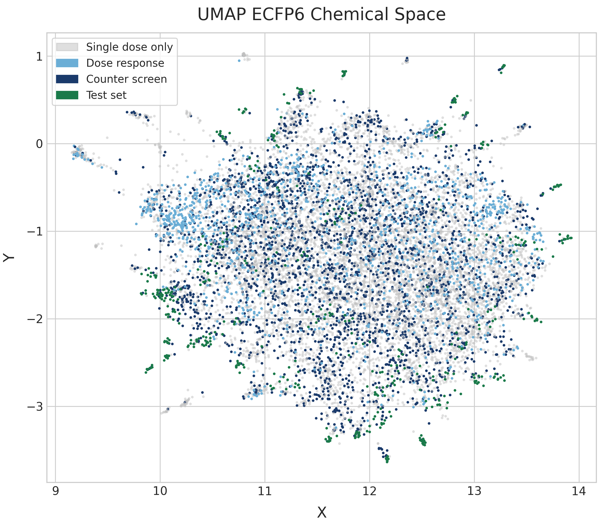
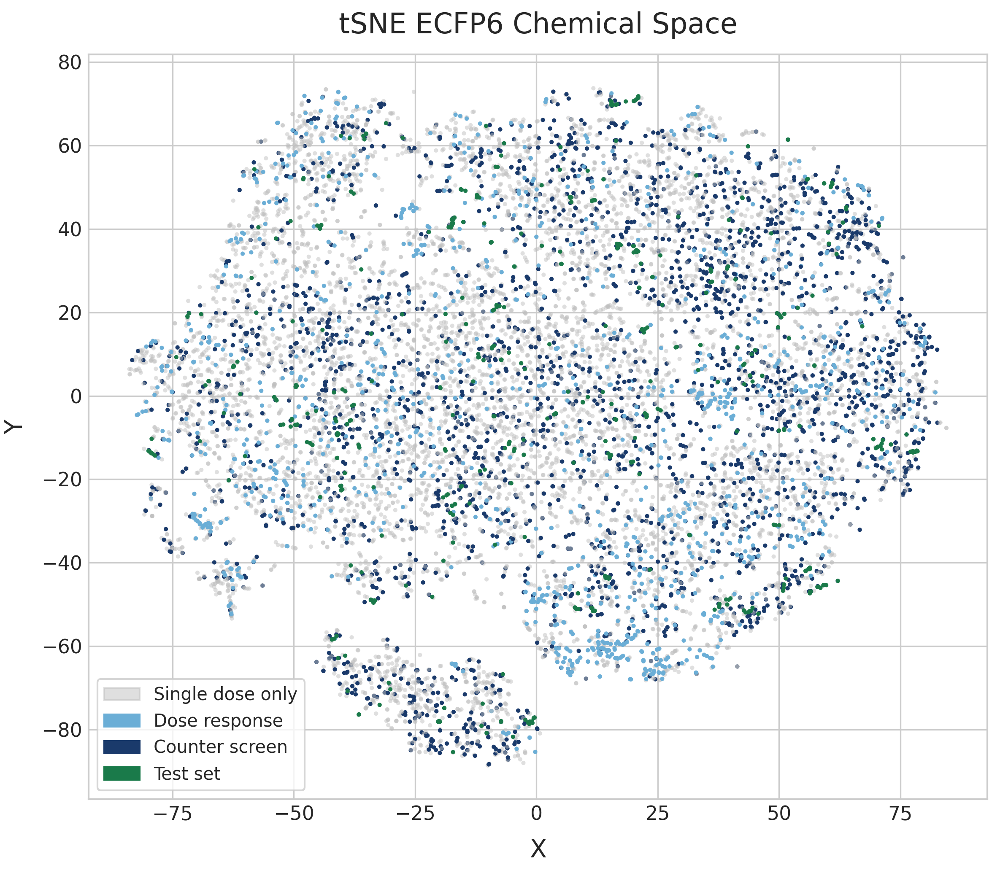
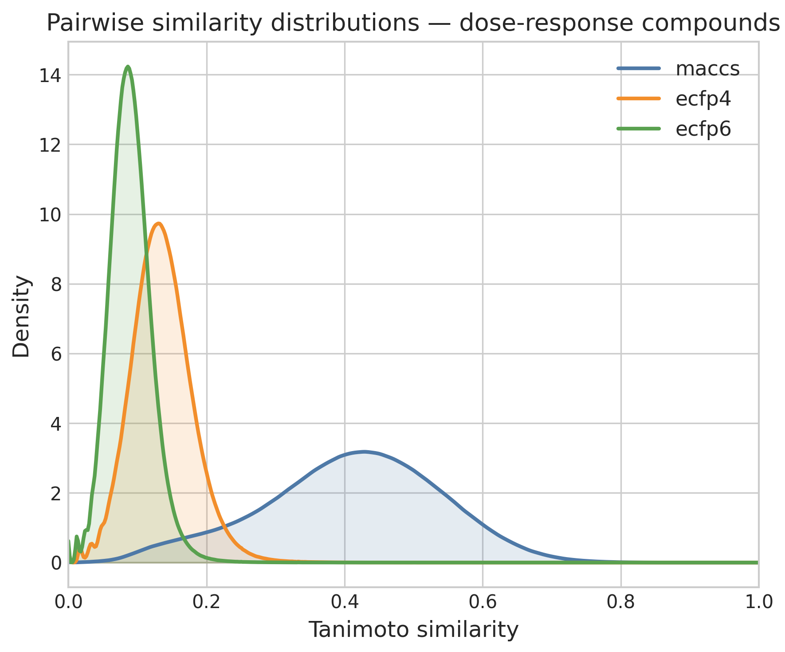
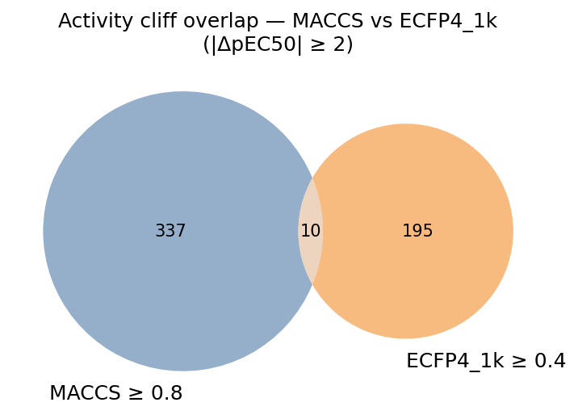
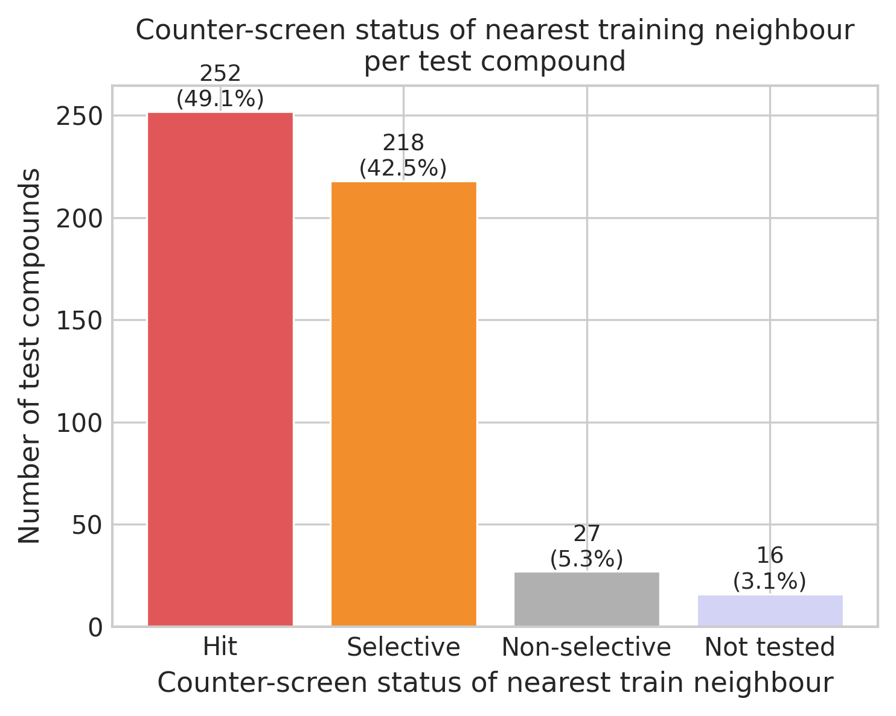

# Chemical Space, Activity Patterns, and Structure–Activity Relationships in the PXR Challenge Dataset

*April 2026*

---

## Dataset Overview

The challenge comprises four experimental screens consolidated into a single table of **12,782 unique compounds** (identified by InChIKey). The datasets are hierarchically nested rather than independent:

| Dataset | Compounds | Role |
|---|---|---|
| Single-dose screen | 12,269 | Primary assay — most tested compounds |
| Dose-response (training) | 4,138 | Quantitative pEC50 + Emax; prediction target |
| Counter screen | 2,858 | Selectivity filter; subset of dose-response |
| Test set (blinded) | 513 | No labels; held-out for prediction |

The dose-response set is entirely contained within the single-dose screen. The counter screen is entirely contained within the dose-response set. The test set has **no overlap** with either the dose-response training set or the counter screen — it is a clean hold-out.

Of the 12,269 screened compounds, **8,131 appear only in the single-dose screen** and have no dose-response data. These represent the broad hit-finding funnel from which the quantitative training data was derived.

---

## Activity Distribution

### Single-dose hit rates

At 30 µM — the most widely tested concentration — **25.6% of compounds** (2,439 / 9,523) were classified as hits (median log₂FC > 1, FDR-BH < 0.05). The hit rate drops sharply with concentration: 8.1% at 10 µM (875 / 10,747). The highest concentration tested (100 µM, n = 706) yields a 61.2% hit rate, consistent with compounds active only at high concentration. The small 1 µM subset (n = 27) was tested selectively on already-confirmed actives and is not representative of the broader hit rate.

### pEC50 distribution in the dose-response training set

The pEC50 distribution (n = 4,138) is left-skewed, concentrated in the low-to-moderate potency range:

- **Mean pEC50: 4.32** (SD 1.12); **median: 4.65**
- 30.1% of compounds have pEC50 < 4 (weak activity; EC50 > 100 µM)
- 68.3% fall in the 4–6 range (moderate activity)
- Only **67 compounds (1.6%) have pEC50 ≥ 6** (EC50 ≤ 1 µM)
- Range spans nearly 6 log units (1.61–7.55)

Emax (log₂FC vs. baseline) ranges from 1.59 to 5.74; 26.0% of compounds show Emax ≥ 3 (strong induction) and 58.9% fall in the 2–3 range. The wide dynamic range and realistic proportion of weak and strong activators make this a challenging but tractable regression problem.

### Counter-screen selectivity

Of the 4,138 dose-response compounds, 2,858 were also tested in the counter screen, and 2,646 have quantitative pEC50 values in both assays. The Pearson correlation between the two pEC50 values is r = 0.107, confirming orthogonality — the counter screen captures a different biological signal rather than a technical replicate.

Among the 2,646 compounds with dual measurements (selectivity threshold: ΔpEC50 = pEC50_DR − pEC50_counter):

- **1,721 (65%)** are DR-selective (ΔpEC50 > 1 unit)
- **1,129 (43%)** are highly selective (ΔpEC50 > 2 units)
- **875 (33%)** are non-selective (|ΔpEC50| ≤ 1 unit)
- Only **50 (2%)** are counter-selective (stronger counter signal than primary)

Using a more stringent threshold (ΔpEC50 > 1.5), **1,451 compounds (55%)** are selective, of which **46 are confirmed hits** (selective and pEC50_DR ≥ 6). The low correlation and large fraction of DR-selective compounds indicate that most activity in the primary screen is target-specific.

---

## Chemical Space

### UMAP and t-SNE embeddings

ECFP6 fingerprints (radius 3, 4096-bit, count-based, chirality-aware) were computed for all 12,782 compounds. UMAP (Jaccard metric) and t-SNE (PCA pre-reduction to 50 components) project the full collection into 2D.

The UMAP reveals a single, broadly dispersed cloud with no strong cluster separation. The absence of tight, well-separated clusters indicates **high chemical diversity without dominant scaffold families**. Dose-response compounds (light blue) and counter-screen compounds (dark blue) are distributed throughout the same space as the single-dose compounds (grey), confirming that the hit-selection pipeline did not introduce strong structural bias.

The test set (dark green, n = 513) is similarly distributed across the embedding. No regions of chemical space are entirely absent from the training data.

The t-SNE embedding corroborates this. The library is diffuse; no structural class dominates. A handful of small, isolated clusters at the periphery likely represent structurally unique scaffolds with few analogues in the collection.

### pEC50 landscape across chemical space

The UMAP of dose-response compounds coloured by pEC50 (recomputed on this subset to maximise structural resolution) shows that high-potency compounds (pEC50 > 6) are **scattered throughout chemical space** rather than concentrated in one region. Multiple chemotypes contribute to activity; global structural similarity to known actives is a poor proxy for potency.

---

## Pairwise Similarity Distributions

### Fingerprint-dependent similarity profiles

Pairwise Tanimoto similarities were computed for all unique compound pairs in the dose-response training set using four fingerprint representations.

All four distributions are heavily left-skewed with modes below 0.2, confirming that the dose-response set is structurally diverse. ECFP4 (1k and 4k bit vectors) and ECFP6 peak near Tanimoto = 0.1, while MACCS — which captures broader pharmacophoric features — has a wider distribution peaking near 0.45. ECFP6 is shifted left relative to ECFP4, reflecting its sensitivity to finer structural differences; even the bit-size change from 1024 to 4096 bits for ECFP4 introduces a minor but measurable leftward shift.

This fingerprint dependence has a direct practical consequence: a Tanimoto similarity value is meaningless without specifying the fingerprint. The rule-of-thumb thresholds used here — ECFP4 ≥ 0.4 and MACCS ≥ 0.8 — were chosen to sit near the 95th–99th percentile of their respective distributions, capturing only the most structurally related pairs.

### Train–test similarity comparison

Three distributions are overlaid: within-train, within-test, and train-vs-test (cross-set) ECFP4 Tanimoto similarities. All three are virtually superimposable, peaking near Tanimoto = 0.12–0.15. **The test set is statistically indistinguishable from the training set in structural diversity and coverage.** Models face an interpolation problem within a shared chemical landscape, not an out-of-distribution extrapolation problem. This also means that nearest-neighbour similarity-based baselines will have access to reasonable structural analogues for most test compounds — indeed, almost all test compounds have a training-set neighbour above the 0.4 ECFP4 threshold.

---

## Matched Molecular Pair Network

MMPs were enumerated using mmpdb across all 12,782 compounds. After filtering to retain only pairs where the variable substituent is smaller than the common core (core_transform_ratio < 1.0), the filtered MMP table connects 19% of the dose-response set via 1,503 valid pairs across 783 unique compounds.

The MMP network is fragmented: one large hub cluster, several medium clusters, and many isolated pairs. The large, diffuse grid-like region represents compounds with single-substituent changes at common positions — systematic analogues sharing a common core. The denser cluster represents a more deeply explored chemotype with multiple overlapping transformations. Test-set compounds (green) appear in several clusters alongside training compounds, consistent with the near-identical similarity distributions.

---

## Activity Cliffs

Activity cliffs (ACs) are pairs of structurally similar compounds with large differences in biological activity. They are the most information-dense SAR signal in the dataset and the hardest prediction targets.

### MMP-based cliffs

Applying |ΔpEC50| ≥ 2 to the 1,503 MMP pairs within the dose-response set identifies **60 activity cliff pairs** — 7.7% of MMP-connected compounds. The maximum ΔpEC50 across an MMP is 3.77 log units (mean of cliff pairs: 2.54). The scarcity of MMP cliffs reflects the low MMP propensity of a structurally diverse library: steep potency gradients have fewer opportunities to be observed when structural neighbours are rare.

### Fingerprint-based cliffs and fingerprint dependence

Using a broader similarity definition expands the cliff count substantially. For MACCS (Tanimoto ≥ 0.8) and ECFP4 (Tanimoto ≥ 0.4), both requiring |ΔpEC50| ≥ 2, the total similar-pair pools and cliff fractions differ markedly due to the different similarity distributions of the two fingerprints.

The Venn diagram of MACCS- and ECFP4-defined cliff pairs reveals that the two fingerprints identify largely non-overlapping sets of activity cliffs. Only a small fraction of pairs (~10 out of cumulatively > 500 cliffs) are identified as cliffs by both criteria — these consensus cliffs are the most robustly defined ACs in the dataset. The near-complete non-overlap illustrates that activity cliff identity is as much a property of the fingerprint as of the underlying chemistry: MACCS captures pharmacophoric similarity and ECFP4 captures atomic environment similarity, and a pair can be similar under one definition while dissimilar under another.

---

## Train–Test Coverage and Selectivity Context

### Counter-screen status of nearest training neighbours

For each of the 513 test compounds, we identified its nearest neighbour (NN) in the dose-response training set by ECFP4 Tanimoto similarity. We then asked what counter-screen data exists for those NNs.

The majority of test compounds have NNs that are classified as selective (ΔpEC50_DR − counter > 1.5) or confirmed hits (selective and pEC50_DR ≥ 6). The fraction classified as "Not tested" in the counter screen is small, meaning the training data provides selectivity context for most of the chemical space the test set probes. The relatively modest "Hit" category — NNs that are both potent and selective — may reflect that the test set was assembled from a broader analogue pool, where the structural nearest training neighbour is not necessarily the most potent representative of that chemotype.

---

## Scaffold Analysis

Scaffold decomposition at three hierarchical levels (individual ring systems → linked ring systems → full Bemis-Murcko scaffold) was performed for all unique molecules. The scaffold coverage scatter (dose-response training vs. test set, log-log scale) shows that the most frequent scaffolds in the training set are well-represented in the test set. Scaffolds present in hundreds of training compounds also appear across tens of test compounds.

A key finding from this analysis: the test set is **not** composed of a small number of analog series around confirmed hit scaffolds, as the "analog set" label might suggest. Despite having high structural similarity to training compounds (as shown by the train/test comparison above), the test set is itself structurally diverse — spanning many distinct scaffolds. Some test-set scaffolds have only 1–2 training compounds as coverage, flagging potential prediction difficulty for those molecules.

---

## Implications for Modelling

Several properties of this dataset carry direct consequences for model design and evaluation:

1. **High diversity, limited MMP propensity.** Similarity-based methods will struggle: most test compounds have no close structural analogues in the training set at strict thresholds, and the MMP network connects only ~19% of the dose-response set. Models that rely on interpolation in fingerprint space face sparse neighbourhoods throughout.

2. **Multi-modal SAR.** Potent compounds are dispersed across chemical space with no dominant structural family. A model with strong local accuracy in one chemotype region cannot be assumed to generalise across others.

3. **Activity cliffs are rare but high-stakes.** The 60 MMP cliff pairs (ΔpEC50 ≥ 2) will disproportionately penalise models under RMSE metrics. Models with smooth, continuous representations will systematically underestimate these cliffs.

4. **Fingerprint choice determines cliff identity.** MACCS and ECFP4 identify largely non-overlapping cliff sets. Any cliff-aware model or training data augmentation strategy should be explicit about which similarity definition it employs, and consensus cliffs (identified by multiple fingerprints) are the most reliably annotated.

5. **Train–test distribution parity.** The near-identical similarity distributions remove one class of failure mode: the test set does not represent an out-of-distribution generalisation problem. Optimising in-distribution accuracy is the right objective.

6. **Counter screen provides orthogonal selectivity signal.** The low DR/counter correlation (r = 0.107) means the counter screen adds genuinely orthogonal information. Incorporating it as an auxiliary target in a multi-task model may improve primary activity predictions and is directly relevant if the challenge scores selectivity.
