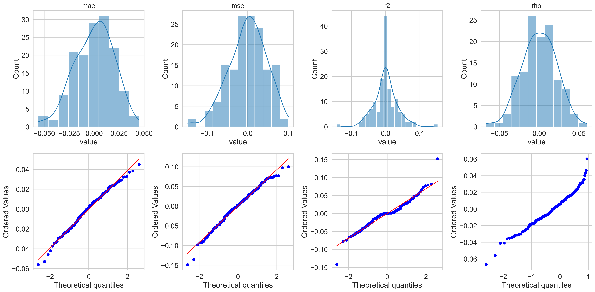
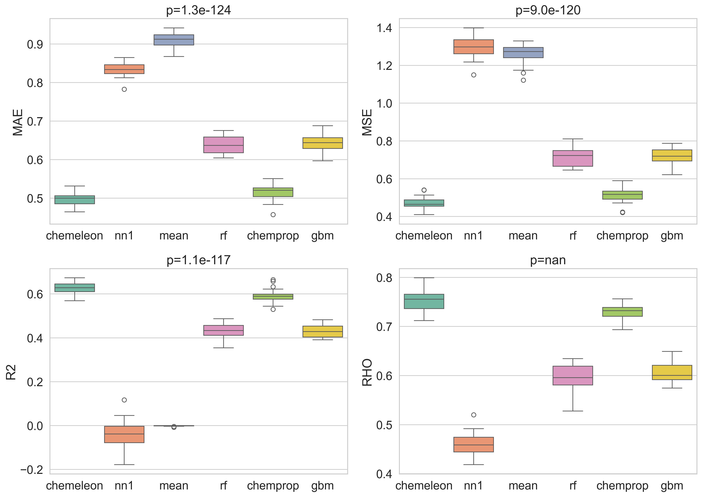
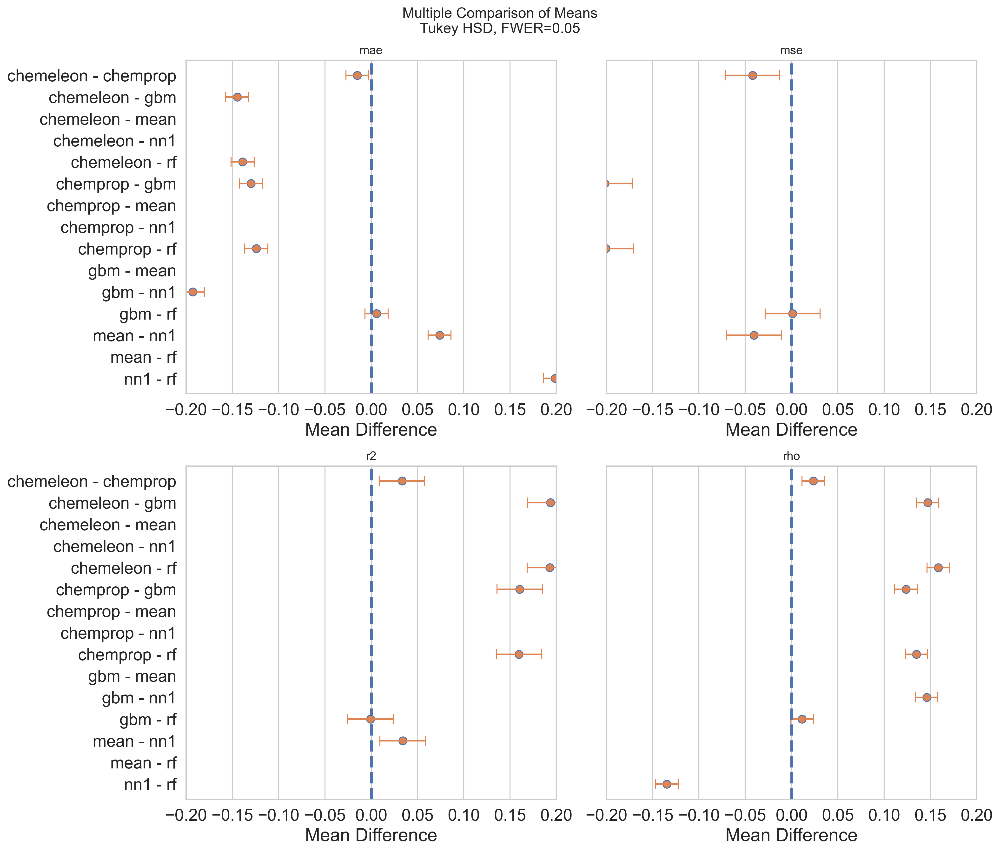
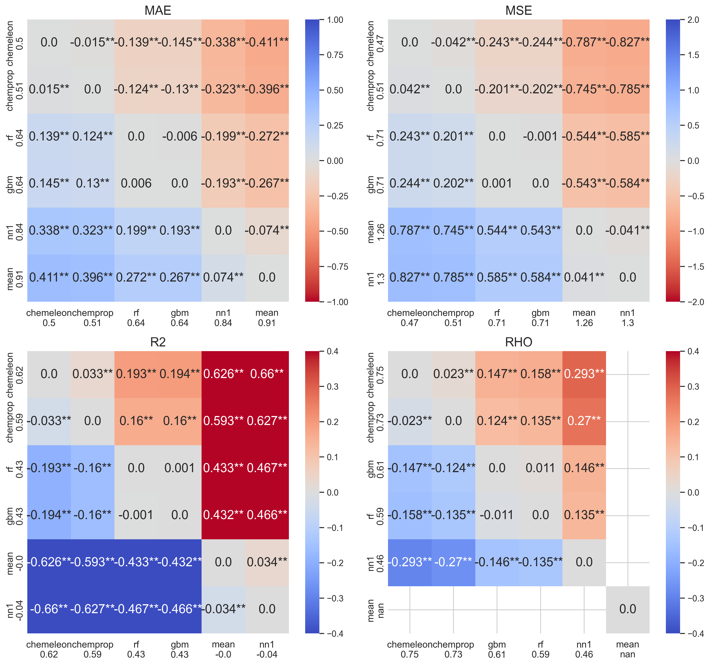

# PXR Challenge #2: Training and Comparing ML Baseline Models

*April 2026*

---

This is the second post in the PXR challenge series. The [first post](2026_04_15_pxr_sar_exploration.html) explored the chemical space, activity distribution, and SAR character of the dataset. Here we move to modelling: we train six model types under three data-split strategies, evaluate them with a rigorous statistical framework, and submit the best model's predictions to the leaderboard.

The full notebook is available as [an interactive HTML export](../html_notebooks/2_ml_baseline.html) and the source code is on [GitHub](https://github.com/adlvdl/pxr_challenge).

---

## Part 1 — Comparing Data Split Strategies

Before training any model it is worth asking: *how hard is the generalisation problem we are setting up?* Two models can have identical cross-validation MAE but face very different test distributions depending on how the CV folds were constructed.

We implemented three complementary strategies and measured their difficulty using **train/test Tanimoto similarity** distributions (ECFP4, radius 2, 2048 bits) across one round of 5-fold CV.

| Strategy | What it tests |
|---|---|
| **Random** | Baseline — molecules are shuffled at random across folds |
| **Scaffold** | Chemical generalisation — folds split by Bemis–Murcko scaffold so the model never sees a scaffold at test time that it trained on |
| **Temporal** | Prospective generalisation — molecules ordered by their numeric ID, used as a proxy for acquisition order |

For each fold and each split method we computed two similarity views:

- **All pairs** — every (test compound, train compound) Tanimoto value; captures the full distributional picture
- **Nearest neighbour (NN)** — only the maximum similarity per test compound; directly measures how close each prediction will be to training data


The results are striking in how *similar* the three strategies are. All three distributions peak around Tanimoto 0.15–0.20 in the all-pairs view, with nearest-neighbour medians between 0.35 and 0.45. The scaffold and temporal splits show only a modest leftward shift relative to the random split.

This outcome is consistent with the structural analysis from post #1: the dose-response set is highly diverse, with the majority of Bemis–Murcko scaffolds represented by only one or two compounds. When scaffolds are this fragmented, scaffold-based splitting degrades to near-random splitting — there are simply no large scaffold families to isolate. Similarly, the temporal split cannot enforce a strong distributional shift because the training set is largely a subset of a single-point screening library rather than a series of iterative DMTA cycles where later compounds build on earlier ones. There is a small shift visible in the nearest-neighbour panel, consistent with some compounds being added in batches.

For a genuinely challenging structure-based split one would instead cluster the full dataset (e.g. by hierarchical clustering or Butina clustering on ECFP4) and hold out entire clusters. Given the near-identical distributions, **we proceed with random CV for all subsequent model comparisons** — it is the simplest strategy and the similarity analysis suggests it will not give artificially optimistic estimates.

---

## Part 2 — Models

Six model types were implemented, sharing a stable `train()`/`predict()` API:

| Model | Backend | Input |
|---|---|---|
| `MeanBaseline` | Predict the training-set mean for every compound | None |
| `NearestNeighbourBaseline` | Predict the label of the most similar training compound (1-NN, Tanimoto) | ECFP fingerprint |
| `RandomForestModel` | scikit-learn Random Forest Regressor | ECFP fingerprint |
| `BoostedTreesModel` | XGBoost Regressor with early stopping | ECFP fingerprint |
| `ChempropModel` | Chemprop v2 D-MPNN trained from scratch | SMILES |
| `ChempropChemeleonModel` | Chemprop v2 fine-tuned from the [CheMeleon](https://github.com/JacksonBurns/chemeleon) pretrained backbone | SMILES |

The two baselines serve as lower bounds rather than real competitors. The **mean baseline** should produce R² = 0 by definition (it predicts a constant) and an undefined Spearman ρ — it tells us the worst-case MAE we could achieve with no information at all. The **nearest-neighbour baseline** is a useful sanity check: if a model with learned representations cannot beat 1-NN retrieval, something is wrong.

All fingerprint-based models used **ECFP4** (radius 2, 2048 bits). A 10 % validation split was carved from each training fold for XGBoost early stopping and Chemprop early stopping (50 epoch maximum).

---

## Part 3 — Cross-Validation Setup

We ran **5 × 5 nested cross-validation** (5 outer × 5 inner folds, 25 folds total) using random molecule assignment. For each fold:

1. ECFP4 fingerprints are generated fresh on the fold's train/val/test subsets.
2. All six models are trained and predictions are collected.
3. Every prediction is written to a long-format CSV: `inchikey | molecule_names | smiles | fold | outer_fold | inner_fold | model | y_true | y_pred`.

The target column is `pEC50_dr` — the dose-response pEC50 from the primary assay, the same quantity submitted to the challenge leaderboard.

Training all six models across 25 folds took approximately **7 hours** on a base M4 Mac Mini (the Chemprop-based models dominate the wall time).

---

## Part 4 — Statistical Comparison Framework

A common mistake in ML benchmarking is ranking models by their mean metric across folds and treating the order as meaningful without assessing whether differences are statistically significant. The key problem is that folds are shared across models — the same train/test split is seen by every model — creating a repeated-measures structure that ordinary t-tests ignore and that inflates false-positive rates.

We follow the approach from [polaris-hub/polaris-method-comparison](https://github.com/polaris-hub/polaris-method-comparison), which applies established repeated-measures statistics to CV results.

The workflow has six steps:

1. **Compute per-fold metrics** — MAE, MSE, R², and Spearman ρ for each (fold, model) pair.
2. **Scatter plots** — visual inspection of predicted vs. measured values pooled across all 25 folds.
3. **Normality diagnostics** — histograms and Q–Q plots of the per-method metric residuals. Repeated-measures ANOVA requires approximately normal residuals; if violated, use the non-parametric equivalent.
4. **Repeated-measures ANOVA** — tests whether *any* model differs significantly from the others while accounting for the shared fold structure.
5. **Friedman test** — the non-parametric equivalent of step 4; used as a cross-check or primary test if normality fails.
6. **Tukey HSD pairwise comparisons** — identifies *which* model pairs differ significantly, with family-wise error rate control.

### Step 1 — Scatter plots: predicted vs measured

Each panel shows one model's predictions pooled across all 25 folds. The dashed diagonal is the identity line; red dashed lines mark the pEC50 = 4.0 activity threshold used for precision/recall. Metric values shown are fold-averaged.


The mean baseline produces the expected horizontal stripe at the training mean (~4.3). The nearest-neighbour baseline spreads predictions more but shows considerable noise — the predicted–measured correlation is low, consistent with the high structural diversity discussed in post #1. The fingerprint-based models (RF, XGBoost) produce noticeably tighter clouds, and the MPNN-based models (Chemprop, CheMeleon) are tighter still. CheMeleon's scatter is visibly closest to the diagonal.

### Step 2 — Normality diagnostics

Before applying ANOVA we assess the normality of the per-method metric residuals (each value minus its group mean).



The residuals are reasonably bell-shaped for MAE and R² but show mild heavy tails for MSE and ρ. The Q–Q plots confirm approximate normality for MAE and R², with some deviation at the extremes. We proceed with both parametric (ANOVA) and non-parametric (Friedman) tests and compare their conclusions.

### Step 3 — Boxplots with repeated-measures ANOVA p-values

Each box shows the cross-fold distribution of a metric for one model. The panel title reports the **repeated-measures ANOVA p-value** — the probability of observing differences this large if all models were equivalent, after accounting for the shared-fold structure.



All four metrics yield p < 0.05, confirming that the models are not statistically equivalent. The ordering is consistent across metrics: CheMeleon best, then Chemprop, then RF and XGBoost, with the two baselines at the bottom. The inter-fold variance is noticeably higher for the baselines than for the learned models, reflecting the greater sensitivity of retrieval methods to fold composition.

### Step 4 — Boxplots with Friedman test p-values

The Friedman test makes no normality assumption and serves as a cross-check.


The Friedman p-values are consistent with the ANOVA p-values: all four metrics remain significant, and the qualitative ordering of models is unchanged. The agreement between parametric and non-parametric tests gives us confidence that the ANOVA conclusions are robust.

### Step 5 — Tukey HSD confidence-interval plots

These plots show pairwise mean differences between models with 95 % simultaneous confidence intervals. Intervals that do not cross zero indicate a statistically significant difference.



For MAE, R², and ρ, CheMeleon is significantly better than all other models. Chemprop is significantly better than RF and XGBoost. The RF vs. XGBoost comparison is not significant on most metrics — their confidence intervals straddle zero — though XGBoost has a small numerical advantage in ρ. The two baselines are clearly separated from all learned models.

### Step 6 — Multiple-comparison heatmaps

Each cell shows the mean difference between the row model and the column model. Colour encodes direction and magnitude; significance stars follow the standard convention (*** p < 0.001, ** p < 0.01, * p < 0.05).

For metrics to **maximise** (R², ρ) warm colours mean the row model is better; for metrics to **minimise** (MAE, MSE) the colourmap is reversed so warm still means the row model is worse.



The heatmaps make the pairwise story concrete:

- **CheMeleon** is significantly better than every other model across all four metrics — the top row is uniformly warm.
- **Chemprop** beats RF and XGBoost across all metrics, confirming that learning directly from SMILES with an MPNN adds value over fingerprint compression.
- **XGBoost** beats RF only on ρ; the other three metrics are not significant.
- **MeanBaseline** and **NearestNeighbourBaseline** are dramatically worse, as expected. The mean baseline achieves R² = 0 by construction; its ρ is undefined (NaN, displayed as 0 here). The nearest-neighbour baseline's worst-case MAE was **0.91** — predictions off by nearly one order of magnitude on average — though its R² was slightly negative, meaning it is marginally worse than predicting the mean.

---

## Part 5 — Final Model and Submission

Based on the CV results, we trained a **CheMeleon model on the entire dose-response training set** (4,138 compounds) and predicted the 513 held-out test compounds.

A 10 % random validation split (415 compounds) was drawn from the training data for early stopping — this is not the competition test set. The model was trained for up to 50 epochs, with the best checkpoint selected by validation loss.

The submission was prepared in the format required by the challenge validator:

```
SMILES | Molecule Name | pEC50
```

and passed all validation checks (513 rows, no missing identifiers, all pEC50 values numeric and finite).

### Leaderboard results

At the time of submission we were **rank 57 of 84**, just above the LightGBM baseline provided by OpenADMET.

| Set | MAE | R² | ρ |
|---|---|---|---|
| 5×5 CV (random) | 0.50 | 0.62 | 0.75 |
| Leaderboard test | 0.574 | 0.336 | 0.708 |

The gap between CV and test performance is larger than the inter-fold variance within CV would predict — particularly for R², which falls from 0.62 to 0.34. MAE and ρ degrade more moderately. This pattern is consistent with a distributional shift between the CV training data and the true test set: either the test set pEC50 values have a different range or shape than the training distribution, or the model's predictions compress into a narrower range than the true test values. A natural next step would be to inspect the prediction distribution directly rather than relying solely on aggregate metrics.

It is worth emphasising that this result was **expected**: no hyperparameter optimisation, feature engineering, or ensemble methods were applied. The CheMeleon model was run with default settings and a fixed 50-epoch budget. The primary goal of this notebook was to establish a reproducible statistical comparison framework and a clean prediction baseline, not to chase leaderboard rank.

---

## Summary and Next Steps

This notebook established three things:

1. **Data split strategy matters less than expected** for this dataset. The high structural diversity of the dose-response set means scaffold and temporal splits produce nearly the same train/test similarity distributions as a random split. A clustering-based split would be needed to create a genuinely hard out-of-distribution benchmark.

2. **MPNN-based models with pretrained initialisation outperform fingerprint-based models** significantly and consistently. CheMeleon > Chemprop > XGBoost ≈ RF, with all differences except XGBoost vs. RF reaching statistical significance. The gain from pretraining (CheMeleon over Chemprop from scratch) is large and consistent across metrics.

3. **A rigorous statistical framework prevents overconfident conclusions.** The repeated-measures ANOVA / Friedman / Tukey HSD pipeline correctly identifies that RF and XGBoost are not significantly different on most metrics, while simpler mean comparisons would suggest XGBoost is consistently better.

Possible directions for the next post:

- Hyperparameter optimisation for CheMeleon (learning rate, epochs, batch size)
- Multi-task learning using the counter-screen pEC50 as an auxiliary target
- Ensemble methods combining CheMeleon with fingerprint-based models
- Feature engineering: physicochemical descriptors, 3D conformer-based fingerprints (E3FP, MQNs)
